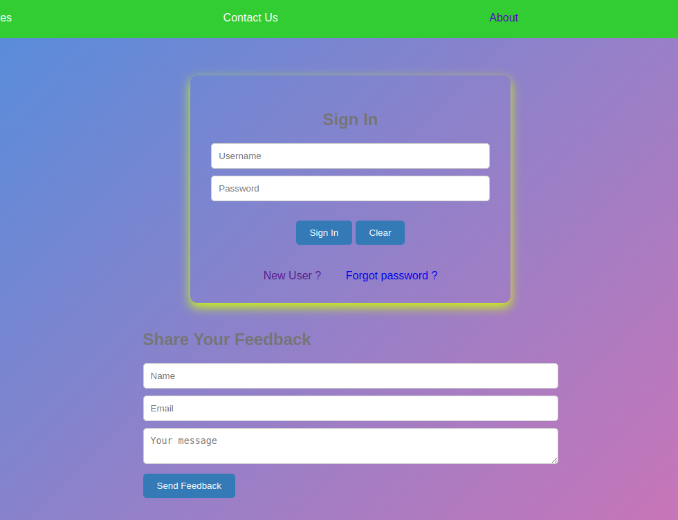
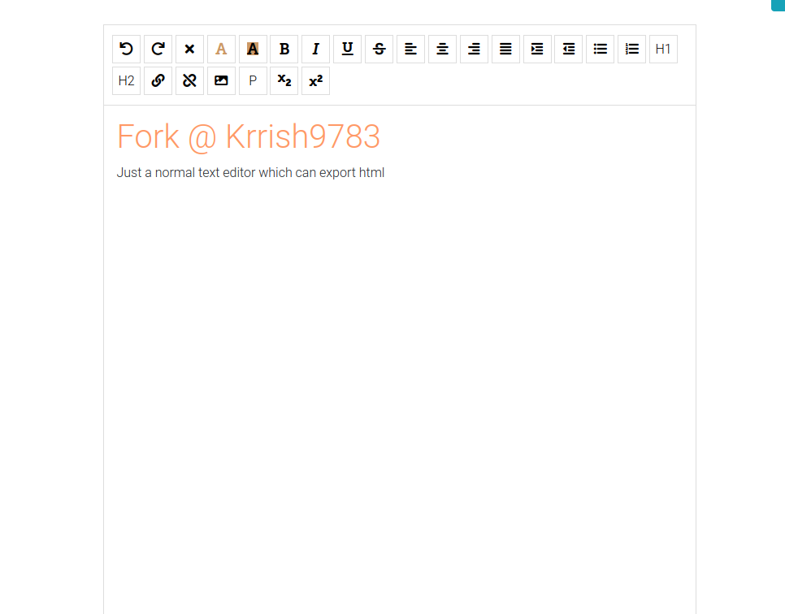

# AI-Tools: Your All-in-One AI Assistant

Welcome to AI-Tools, your go-to solution for a variety of AI tasks! This versatile tool offers a range of functionalities, making it your ultimate AI assistant. From converting text to voice, voice to text, language translation, to serving as a smart text editor, AI-Tools has you covered.

 

## Features


1. **Text-to-Voice Conversion**
   Transform written text into high-quality, natural-sounding speech. Whether you need to bring your written content to life or assist users with accessibility needs, our Text-to-Voice feature provides a seamless solution.

2. **Voice-to-Text Conversion**
   Quickly transcribe spoken words into written text. Perfect for capturing ideas on the go, recording meeting minutes, or creating textual content without the need for manual typing.

3. **Language Translation**
   Break down language barriers effortlessly. Our Language Translation feature supports translation between various languages, making communication across borders easier than ever.

4. **Smart Text Editor**
   AI-Tools comes equipped with a smart text editor that leverages different APIs to enhance your editing experience. Enjoy features like intelligent suggestions, grammar checking, and more.

 

## Getting Started

### Prerequisites
- HTML5 support
- local-server-xamm/lammp
- Internet connection for API access

### Installation
1. Clone the repository:
   ```bash
   git clone https://github.com/krrish9783/AI-Tools.git

### Usage
Choose your desired AI task from the user-friendly interface.
Input the text or voice data as needed.
Let AI-Tools work its magic!
Explore the output or use the text editor features for seamless editing.
Contributing
We welcome contributions from the community! Whether it's adding new features, improving existing functionalities, or fixing bugs, your input is valuable. Please refer to our Contributing Guidelines for more details.

License
This project is licensed under the MIT License.

Acknowledgments
AI-Tools relies on the power of various APIs, and we express our gratitude to the developers and organizations behind these technologies.

Thank you for choosing AI-Tools! We hope it simplifies your AI-related tasks and enhances your productivity. Feel free to reach out with feedback or suggestions. Happy coding! 🚀